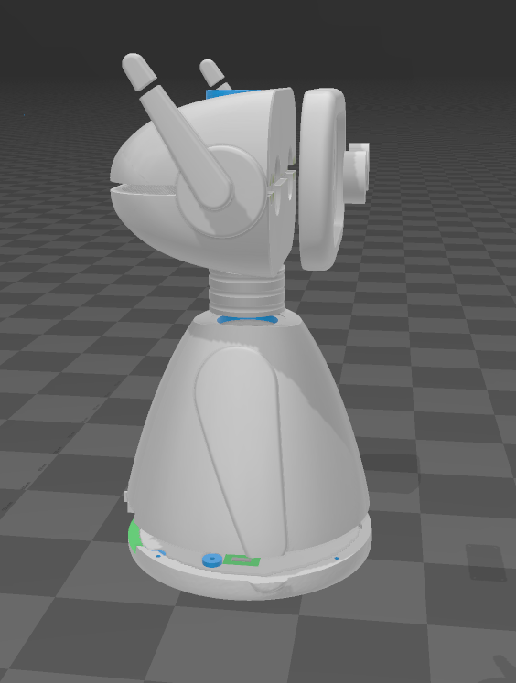
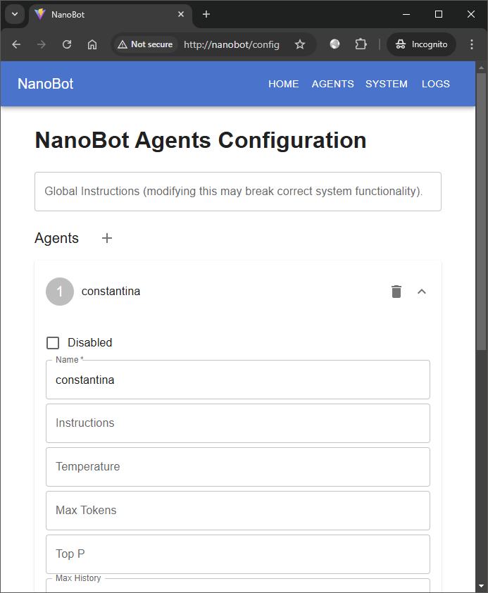
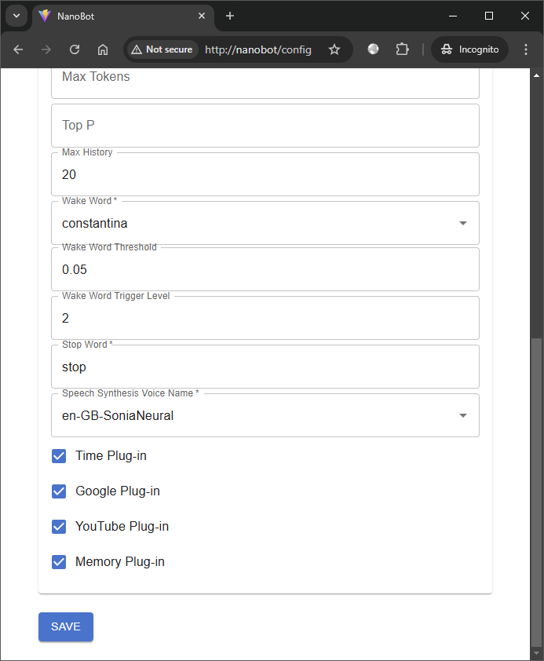
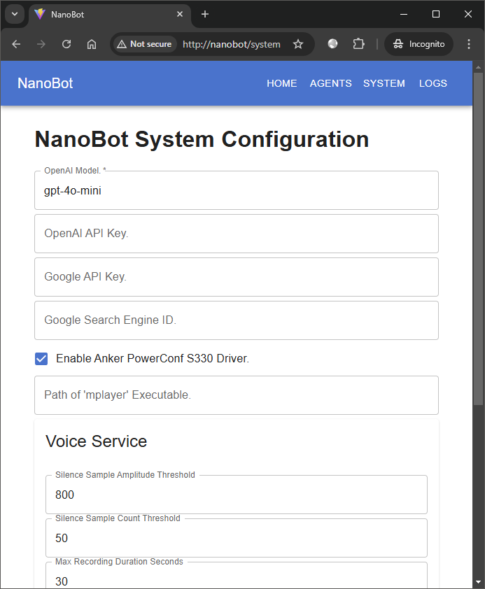
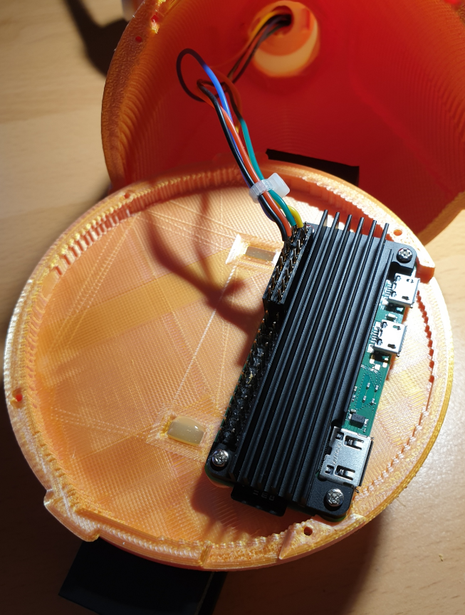
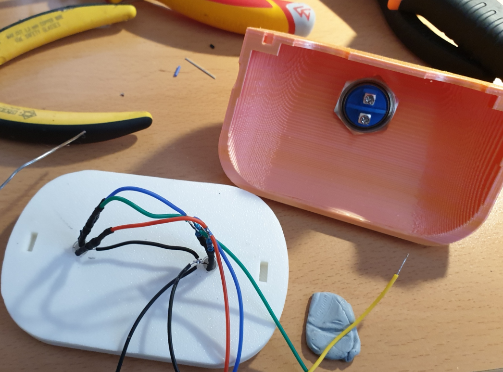

# NanoBot

**NanoBot** is a free, DIY Raspberry Pi-powered AI chat robot, ideal for kids' education and teaching assistance. It can answer challenging questions on a wide range of topics and serve as a live encyclopedia.

It uses various technologies such as the _Semantic Kernel_ with native plug-ins to enhance its capabilities, an optional _RAG_ pipeline for persistent memory, an _ONNX_ runtime-based inference engine for a fully offline wake-word detection experience, etc.

<a href="collage.jpg">

<a href="image-8.png"></a> <a href="image-9.png"></a>

<a href="image.png"></a> <a href="image-1.png"></a> <a href="image-2.png"></a>

A minimal example using the wake-word _constantina_ and asking a question with no follow-up message or plug-in invocations:

https://github.com/user-attachments/assets/a3b1ffc4-5398-4894-bc98-23dac8880478

## Features

NanoBot has a Web configuration page where functionality can be further tailored to user needs.

The baseline AI functionality is provided by the [OpenAI Platform](https://platform.openai.com/) API, so to experience the minimum capabilities of Nanobot a OpenAI Platform account is required at minimum.

NanoBot keeps running costs to the bare minimum by combining OpenAI's chat completion engine with external APIs for the _STT_ (speech-to-text) and the _TTS_ (text-to-speech) robot capabilities. The default AI chat completion engine uses _gpt-4o-mini_, which is cheap. _STT_ is provided by OpenAI's _whisper-1_, incurring minimal extra costs but performing comparatively well. _TTS_ is provided by either OpenAI's _tts-1_ (incurs extra cost, average user experience but no other dependencies) or the Azure Speech Service API (excellent user experience and free but requires creation of an Azure account).

Speech generation is configurable at the Web configuration page and as said, can be provided by either OpenAI (_tts-1_) or by the Azure Speech Service, which further requires the creation of an Azure account, but other than that it is free. The Azure Speech Service has a huge selection of voices and accents and its speech feels more realistic than the OpenAI _whisper-1_ speech generation, but as said, its use is optional.

NanoBot can do much more than being a conversational live encyclopedia. It is configurable with optional skills such as: 
- Searching the Web (Google search). 
- Knowing about the current date and time.
- Remembering things from past conversations, if asked to do so. 
- It can also control its eye colour and obey to user's "turn off" and "restart" commands.

NanoBot is activated (i.e. starts listening to questions) by configurable wake words or by a button press (the talk/hangup button) on the top of its head or on the *Anker PowerConf S330* speakerphone, if available. Its wake-word AI engine runs fully locally on the CPU (without using the Internet, to ensure privacy). It includes a set of preconfigured, selectable wake-words (alexa, hey_jarvis, hey_marvin, hey_mycroft) as part of the [NanoWakeWord](https://github.com/samartzidis/NanoWakeWord) engine that was especially developed for NanoBot as well as the extra one: *constantina*, that was created for Nanobot.

It is tailored and optimised for the `Raspberry Pi Zero 2 W` platform but will also run fine on the more powerful 3, 4 and 5 models. It requires a 64-bit ARM CPU so it will not run on the Pi Zero 1, Pi 1 and Pi 2.

It self-controls 2 RGB LEDs for changing eye colours via the Raspberry Pi *GPIO* interface. It also includes driver functionality for the *Anker PowerConf S330* speakerphone so that you can talk and listen but also use the 4 different speakerphone buttons to control the robot (mute, talk/hangup - which acts the same as the robot's head button, volume up/down). The robot additionally includes a push-button on the head, which implements *talk hang-up* functionality replicating the *talk/hang-up* touch-button of the speakerphone.

The use of the *Anker PowerConf S330* speakerphone is optional. Any USB-based speakerphone device or a headset can be potentially used, but NanoBot includes a driver for the S330 so that it can take advantage of the speakerphone touch buttons. Given that, it's best to use this speakerphone.

## Operation

#### Eye Colours Legend

- **Off** - The robot is off.
- **White** - The robot is on standby.
- **Yellow** - The robot has detected a wake-up word and is initializing a configured agent.
- **Green** - The robot is listening for user speech. This mode almost immediately follows after the previous one.
- **Magenta** - The robot is talking.
- **Cyan** - The robot is thinking, i.e. invoking the OpenAI API for AI.
- **Blue** - The robot is invoking one of its internal plug-ins (e.g. the persistent memory store plug-in or the date/time plug-in, etc.). This is also mentioned as the deep-thinking phase.
- **Red** - An error has occured. If it is a transient error, e.g. an external API timeout, it will automatically recover. If not, you may want to inspect the logs (via the management Web-page or the SSH).

#### Operation Cycle

1. _Standby phase:_ The robot's eyes are white. The robot is waiting to wake up by voice or a talk/hangup buttons press.
2. _Wake-up phase:_ Talk to the robot using the configured wake-up word or alternatively press the talk/hangup button on its head or the talk/hangup button on the connected S330 device (if available). On wake-word detection the eyes will turn yellow.
3. _Listening phase:_ Then almost immediately the eyes will turn green, meaning that the robot is listening for voice commands. If there is no user voice for a few seconds, this phase will time-out and the robot will go back into stanb-by mode. During this phase, the user can press the talk/hang-up buttons to cancel and return the robot immediately into stand-by.
4. _Thinking/deep-thinking phases:_ After receiving a voice message, the robbot will try to process it by invoking AI APIs and internal plug-ins. The eyes will turn cyan and blue. These phases can be interrupted as previously, by pressing the talk/hang-up buttons.
5. _Response phase:_ The robot will respond back to the user. Its eyes are magenta while talking back. As previously, this phase can be interrupted by pressing the talk/hang-up buttons. This phase can also be interrupted by saying the configured stop word, which is by default the word: "stop".
6. _Completion/follow-up phase:_ If the robot expects a follow-up conversation message from the user it will automatically enter to Listening Phase again, which can be cancelled by the user if desired. If the robot does not expect a user message, it will go back into the _Listening_ phase again.

## Hardware Build Components and Specific Requirements

- A Raspberry Pi Zero 2 W with a soldered GPIO header (you might as well purchase the Raspberry Pi Zero 2 WH).
- __Optionaly__ an *Anker PowerConf S330* speakerphone or something equivalent (e.g. a USB headset).
- A good heatsink as it can get really hot and start throtting down the CPU. A recommended heatsink is [Geekworm Raspberry Pi Zero 2 W Heatsink](https://www.amazon.co.uk/dp/B09QMBCXLB). Ideally install it using the thermal heatsink paste option instead of the included heatsink pad.
- A 3D printer to print the robot shell. Printing will take several hours but it's relatively straightforwards. No supports required. You will need epoxy glue to glue the shell parts together.
- 5mm round common cathode RGB LEDs for the robot eyes.
- Multicoloured 28AWG (ideally silicone) cables.
- A momentary 19mm push-button for the robot's head. E.g. [this one](https://www.amazon.co.uk/dp/B0DB2BYQKW).
- A self tapping M2 screws. Specifically: 4x 13mm and 4x 11mm. You can also get one of [these sets](https://www.amazon.co.uk/dp/B09NDMWBC2).
- A genuinely at least 2A and 5V micro-USB power supply to power the Pi board (or weird failures will happen during operation if weaker power supply used).
- 2x 4 pin 2.54mm PCB Board Pin Header Connector Strips, that you will use to solder the cables instead of soldering them directly onto the GPIO header pins of the Raspberry Pi Zero 2 WH. E.g. [these](https://www.amazon.co.uk/VooGenzek-Breakaway-Connector-Assortment-Stackable/dp/B09NDMVD2C).
- 6x 220K resistors for each one of the 2 RGB LEDs anode (+) pins.

<a href="image-3.png"></a> <a href="image-4.png"></a>

## GPIO Interface Hardware Connections

- **Ground** (physical **Pin 34**) ⇒ Push **button** terminal 1 (of 2) and to the 2 RGB LED common cathode pins. 
- **GPIO 16** (physical **Pin 36**) ⇒ **Red** RGB LED pins via 220K resistors.
- **GPIO 20** (physical **Pin 38**) ⇒ **Green** RGB LED pins via 220K resistors.
- **GPIO 21** (physical **Pin 40**) ⇒ **Blue** RGB LED pins via 220K resistors.
- **GPIO 26** (physical **Pin 37**) ⇒ Push **button** terminal 2 (of 2).

<a href="pi0-pinout.png">

## Raspberry Pi OS Platform Preparation

1. Install the latest [Raspberry Pi OS Lite (64-bit)](https://www.raspberrypi.com/software/operating-systems/) Operating System, currently Debian version: 12 (bookworm), on the `Raspberry Pi Zero 2 W` device configuring WiFi network connectivity with internet access. Use the [Raspberry Pi Imager](https://www.raspberrypi.com/software/).
2. After finishing installation, SSH to the Pi and install the required OS packages via:
    `sudo apt-get install libasound2-dev`
3. Disable the Raspberry Pi on-board audio functionality:
    Edit: `/boot/firmware/config.txt`
    Add this line in the end: `dtoverlay=vc4-kms-v3d,noaudio`
4. Also add this line to minimise the GPU memory usage: `gpu_mem=32`
5. Edit: `/etc/NetworkManager/NetworkManager.conf` and add the lines: 
    ```
    [connection]
    # Values are 0 (use default), 1 (ignore/don't touch), 2 (disable) or 3 (enable).
    wifi.powersave = 2
    ```
5. Reboot.
6. You can now connect the *Anker PowerConf S330* speakerphone device to the USB port and use the `alsamixer` command to check if it is detected and if everything looks right. You can also adjust the S330 mic sensitivity to about 80%.
7. Install the .NET 8 platform in the `/opt/dotnet8` directory, by following the official installation guides for the Raspberry Pi (e.g. https://learn.microsoft.com/en-us/dotnet/iot/deployment). Also set the following in the bottom of your of `/etc/profile`:
   ```
   export DOTNET_ROOT=/opt/dotnet8
   export PATH="$DOTNET_ROOT:$PATH"
   ```
   The DOTNET_ROOT environment variable is needed when running .NET executables published as a single file, so it is best to set it as well.
8. Ensure that the `dotnet` command is in the PATH of the `pi` user.

## Software Installation

1. Create the directory `/home/pi/nanobot` and copy/extract the release build files there.
2. Check if NanoBot works when running from the console by running: `dotnet NanoBot.dll`.
3. Now install NanoBot as a service. Create and edit the file `/etc/systemd/system/nanobot.service` with the following content:
    ```
    [Unit]
    Description=nanobot service

    [Service]
    Environment=DOTNET_ROOT=/opt/dotnet8
    Environment=PATH=/opt/dotnet8:/usr/bin:/bin
    ExecStart=/opt/dotnet8/dotnet /home/pi/nanobot/NanoBot.dll
    WorkingDirectory=/home/pi/nanobot/
    User=pi

    [Install]
    WantedBy=default.target
    ```
4. Add permissions to user `pi` to open hidraw devices. Only needed if using a USB speakerphone such as the *Anker PowerConf S330* speakerphone for enabling control of the consumer controls (buttons) and lights. Create and edit the file: `/etc/udev/rules.d/99-hidraw-permissions.rules` and set the content:
   ```
   KERNEL=="hidraw*", SUBSYSTEM=="hidraw", MODE="0660", GROUP="pi"
   ```
   Save the file and exit.
   Reload rules and re-trigger:
   ```
   sudo udevadm control --reload-rules
   sudo udevadm trigger
   ```
5. Enable and start the `nanobot` service:
    ```
    systemctl enable nanobot.service
    systemctl start nanobot
    ```

## License and Acknowledgements

NanoBot is licensed under the [MIT license](../LICENSE).

The NanoBot [NanoWakeWord](https://github.com/samartzidis/NanoWakeWord) wake-word detection engine is powered by the [ONNX Runtime](https://onnxruntime.ai/) and was based on the [openWakeWord](https://github.com/dscripka/openWakeWord) project.

The NanoBot 3d printable shell was remixed from the _Wee-bo_ robot model by _Sparrows89_.

